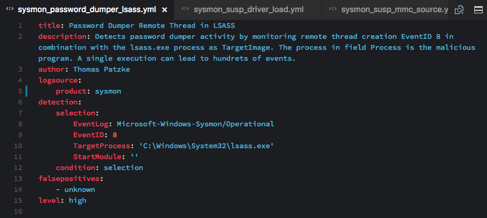
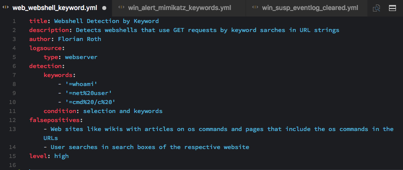

# Sigma
Generic Signature Format for SIEM Systems

# What is Sigma?

Sigma is a generic and open signature format that allows you to describe relevant log events in a straight forward manner. The rule format is very flexible, easy to write and applicable to any type of log file. The main purpose of this project is to provide a structured form in which researchers or analysts can describe their once developed detection methods and make them shareable with others.


This repository contains:

* Sigma rule specification in the [Wiki](https://github.com/Neo23x0/sigma/wiki/Specification)
* Open repository for sigma signatures in the ```./rules```subfolder
* A converter that generate searches/queries for different SIEM systems [in development]

# Converter

The converter is written in Python 3 and requires PyYAML. Invoke it with `--help` for usage instructions.

# Slides

See the first slide deck that I prepared for a private conference in mid January 2017.

[Sigma - Make Security Monitoring Great Again](https://www.slideshare.net/secret/gvgxeXoKblXRcA)


# Specification

The specifications can be found in the [Wiki](https://github.com/Neo23x0/sigma/wiki/Specification). 

The current specification can be seen as a proposal. Feedback is requested.

# Examples

Windows 'Security' Eventlog: Access to LSASS Process with Certain Access Mask / Object Type (experimental)


Sysmon: Remote Thread Creation in LSASS Process


Web Server Access Logs: Web Shell Detection


Sysmon: Web Shell Detection


Windows 'Security' Eventlog: Suspicious Number of Failed Logons from a Single Source Workstation


# Next Steps 

* Creation of a reasonable set of sample rules
* Release of the first rule converters for Elastic Search and Splunk
* Integration of feedback into the rule specifications
* Collecting rule input from fellow researchers and analysts
* Attempts to convince others to use the rule format in their reports, threat feeds, blog posts, threat sharing platforms
