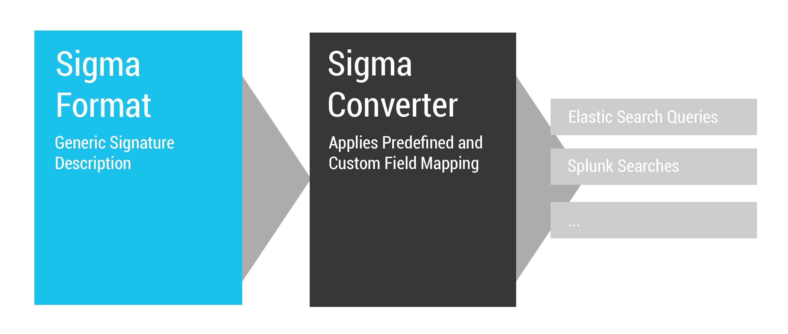
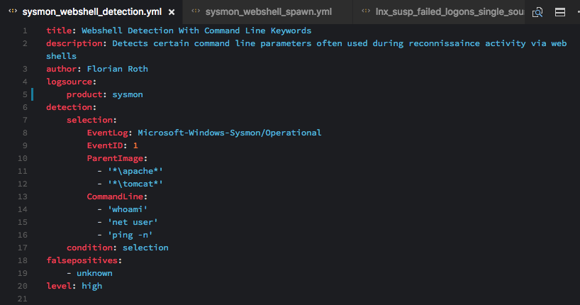
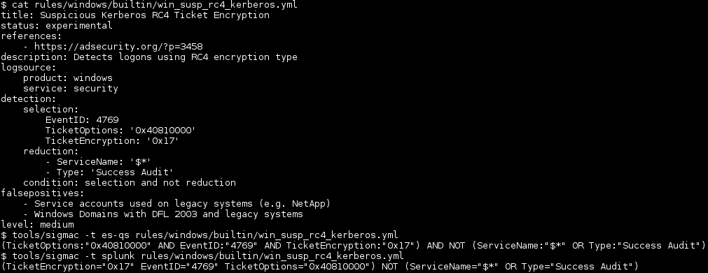

[](https://travis-ci.org/Neo23x0/sigma)


# Sigma

Generic Signature Format for SIEM Systems

# What is Sigma

Sigma is a generic and open signature format that allows you to describe relevant log events in a straight forward manner. The rule format is very flexible, easy to write and applicable to any type of log file. The main purpose of this project is to provide a structured form in which researchers or analysts can describe their once developed detection methods and make them shareable with others.

Sigma is for log files what [Snort](https://www.snort.org/) is for network traffic and [YARA](https://github.com/VirusTotal/yara) is for files.

This repository contains:

* Sigma rule specification in the [Wiki](https://github.com/Neo23x0/sigma/wiki/Specification)
* Open repository for sigma signatures in the `./rules`subfolder
* A converter that generate searches/queries for different SIEM systems [work in progress]



## Hack.lu 2017 Talk

[](https://www.youtube.com/watch?v=OheVuE9Ifhs "Sigma - Generic Signatures for Log Events")

# Use Cases

* Describe your once discovered detection method in Sigma to make it sharable 
* Share the signature in the appendix of your analysis along with file hashes and C2 servers
* Share the signature in threat intel communities - e.g. via MISP
* Provide Sigma signatures for malicious behaviour in your own application (Error messages, access violations, manipulations) 
* Integrate a new log into your SIEM and check the Sigma repository for available rules
* Write a rule converter for your custom log analysis tool and process new Sigma rules automatically
* Provide a free or commercial feed for Sigma signatures

# Why Sigma

Today, everyone collects log data for analysis. People start working on their own, processing numerous white papers, blog posts and log analysis guidelines, extracting the necessary information and build their own searches and dashboard. Some of their searches and correlations are great and very useful but they lack a standardized format in which they can share their work with others. 

Others provide excellent analyses for threat groups, sharing file indicators, C2 servers and YARA rules to detect the malicious files, but describe a certain malicious service install or remote thread injection in a separate paragraph. Security analysts, who read that paragraph then extract the necessary information and create rules in their SIEM system. The detection method never finds a way into a repository that is shared, structured and archived. 

The lower layers of the OSI layer are well known and described. Every SIEM vendor has rules to detect port scans, ping sweeps and threats like the ['smurf attack'](https://en.wikipedia.org/wiki/Smurf_attack). But the higher layers contain numerous applications and protocols  with special characteristics that write their own custom log files. SIEM vendors consider the signatures and correlations as their intelectual property and do not tend to share details on the coverage. 

Sigma is meant to be an open standard in which detection mechanisms can be defined, shared and collected in order to improve the detection capabilities on the application layers for everyone. 


## Slides

See the first slide deck that I prepared for a private conference in mid January 2017.

[Sigma - Make Security Monitoring Great Again](https://www.slideshare.net/secret/gvgxeXoKblXRcA)

# Specification

The specifications can be found in the [Wiki](https://github.com/Neo23x0/sigma/wiki/Specification). 

The current specification is a proposal. Feedback is requested.

# Getting Started

Florian wrote a short [rule creation tutorial](https://www.nextron-systems.com/2018/02/10/write-sigma-rules/) that can help you getting started.

# Examples

Windows 'Security' Eventlog: Access to LSASS Process with Certain Access Mask / Object Type (experimental)


Sysmon: Remote Thread Creation in LSASS Process


Web Server Access Logs: Web Shell Detection


Sysmon: Web Shell Detection


Windows 'Security' Eventlog: Suspicious Number of Failed Logons from a Single Source Workstation


# Sigma Tools

## Evt2Sigma

[Evt2Sigma](https://github.com/Neo23x0/evt2sigma) helps you with the rule creation. It generates a Sigma rule from a log entry.  

## Sigmac 

Sigmac converts sigma rules into queries or inputs of the supported targets listed below. It acts as a frontend to the
Sigma library that may be used to integrate Sigma support in other projects. Further, there's `merge_sigma.py` which
merges multiple YAML documents of a Sigma rule collection into simple Sigma rules.



### Supported Targets

* [Splunk](https://www.splunk.com/)
* [ElasticSearch](https://www.elastic.co/)
* [ElasticSearch Query DSL](https://www.elastic.co/guide/en/elasticsearch/reference/current/query-dsl.html)
* [Kibana](https://www.elastic.co/de/products/kibana)
* [Elastic X-Pack Watcher](https://www.elastic.co/guide/en/x-pack/current/xpack-alerting.html)
* [Logpoint](https://www.logpoint.com)
* Grep with Perl-compatible regular expression support

Current work-in-progress
* [Splunk Data Models](https://docs.splunk.com/Documentation/Splunk/7.1.0/Knowledge/Aboutdatamodels)
* [Windows Defender Advanced Threat Protection (WDATP)](https://www.microsoft.com/en-us/windowsforbusiness/windows-atp)

New targets are continuously developed. You can get a list of supported targets with `sigmac --target-list` or `sigmac -l`.

### Requirements

The usage of Sigmac or the underlying library requires Python >= 3.5 and PyYAML.

### Installation

It's available on PyPI. Install with:

```bash
pip3 install sigmatools
```

Alternatively, if used from the Sigma Github repository, the Python dependencies can be installed with:

```bash
pip3 install -r tools/requirements.txt
```

For development (e.g. execution of integration tests with `make` and packaging), further dependencies are required and can be installed with:

```bash
pip3 install -r tools/requirements-devel.txt
```

## Contributed Scripts

The directory `contrib` contains scripts that were contributed by the community:

* `sigma2elastalert.py`i by David Routin: A script that converts Sigma rules to Elastalert configurations. This tool
  uses *sigmac* and expects it in its path.

These tools are not part of the main toolchain and maintained separately by their authors.

# Next Steps

* Integration of feedback into the rule specifications
* Integration into Threat Intel Exchanges
* Attempts to convince others to use the rule format in their reports, threat feeds, blog posts, threat sharing platforms

# Projects that use Sigma

* [MISP](http://www.misp-project.org/2017/03/26/MISP.2.4.70.released.html) (since version 2.4.70, March 2017)
* [Augmentd](https://augmentd.co/)
* [TA-Sigma-Searches](https://github.com/dstaulcu/TA-Sigma-Searches) (Splunk App)

# Credits

This is a private project mainly developed by Florian Roth and Thomas Patzke with feedback from many fellow analysts and friends. Rules are our own or have been drived from blog posts, tweets or other public sources that are referenced in the rules.

Copyright for Tree Image: [studiobarcelona / 123RF Stock Photo](http://www.123rf.com/profile_studiobarcelona)

# Licenses

The content of this repository is released under the following licenses:

* The toolchain (everything under `tools/`) is licensed under the [GNU Lesser General Public License](https://www.gnu.org/licenses/lgpl-3.0.en.html).
* The [Sigma specification](https://github.com/Neo23x0/sigma/wiki) is public domain.
* Everything else, especially the rules contained in the `rules/` directory is released under the [GNU General Public License](https://www.gnu.org/licenses/gpl-3.0.en.html).
