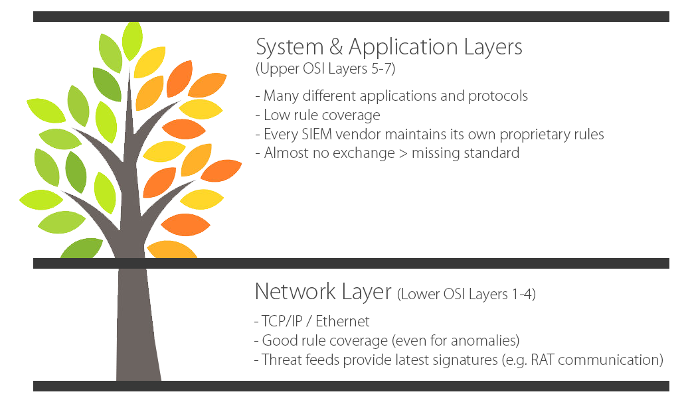
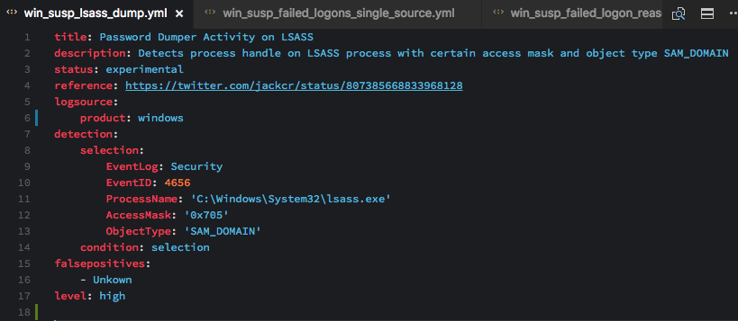
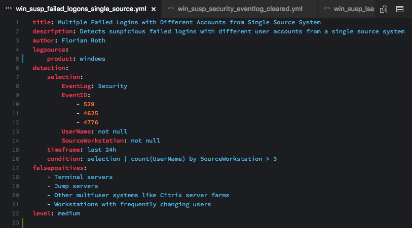

# Sigma
Generic Signature Format for SIEM Systems

# What is Sigma?

Sigma is a generic and open signature format that allows you to describe relevant log events in a straight forward manner. The rule format is very flexible, easy to write and applicable to any type of log file. The main purpose of this project is to provide a structured form in which researchers or analysts can describe their once developed detection methods and make them shareable with others.

Sigma is for log files what [Snort](https://www.snort.org/) is for network traffic and [YARA](https://github.com/VirusTotal/yara) is for files.   

This repository contains:

* Sigma rule specification in the [Wiki](https://github.com/Neo23x0/sigma/wiki/Specification)
* Open repository for sigma signatures in the ```./rules```subfolder
* A converter that generate searches/queries for different SIEM systems [work in progress]

# Use Cases

* Describe your once discovered detection method in Sigma to make it sharable 
* Share the signature in the appendix of your analysis along with file hashes and C2 servers
* Share the signature in threat intel communities - e.g. via MISP
* Provide Sigma signatures for malicious behaviour in your application (Error messages, access violations, manipulations) 
* Integrate a new log into your SIEM and check the Sigma repository for available rules
* Develop an experimental detection method, write a Sigma rule, share it and ask for feedback
* Write a rule converter for your custom log analysis tool and process new Sigma rules automatically
* Provide a free or commercial feed for Sigma signatures

# Sigma Converter

The converter is currently under development in the *devel-sigmac* branch of this project. It has currently the
following capabilities:

* Parsing of Sigma rule files
* Conversion of searches into Elasticsearch and Splunk queries

Planned main features are:

* Conversion of aggregation expressions (after the pipe character)
* Output of Kibana JSON configurations

Support for further SIEM solutions can be added by developing an corresponsing output backend class.


# Why Sigma

Today, everyone collects log data for analysis. People start working on their own, processing numerous white papers, blog posts and log analysis guidelines, extracting the necessary information and build their own searches and dashboard. Some of their searches and correlations are great and very useful but they lack a standardized format in which they can share their work with others. 

Others provide excellent analyses for threat groups, sharing file indicators, C2 servers and YARA rules to detect the malicious files, but describe a certain malicious service install or remote thread injection in a separate paragraph. Security analysts, who read that paragraph then extract the necessary information and create rules in their SIEM system. The detection method never finds a way into a repository that is shared, structured and archived. 

The lower layers of the OSI layer are well known and described. Every SIEM vendor has rules to detect port scans, ping sweeps and threats like the ['smurf attack'](https://en.wikipedia.org/wiki/Smurf_attack). But the higher layers contain numerous applications and protocols  with special characteristics that write their own custom log files. SIEM vendors consider the signatures and correlations as their intelectual property and do not tend to share details on the coverage. 

Sigma is meant to be an open standard in which detection mechanisms can be defined, shared and collected in order to improve the detection capabilities on the application layers for everyone. 



## Slides

See the first slide deck that I prepared for a private conference in mid January 2017.

[Sigma - Make Security Monitoring Great Again](https://www.slideshare.net/secret/gvgxeXoKblXRcA)

# Specification

The specifications can be found in the [Wiki](https://github.com/Neo23x0/sigma/wiki/Specification). 

The current specification can be seen as a proposal. Feedback is requested.

# Examples

Windows 'Security' Eventlog: Access to LSASS Process with Certain Access Mask / Object Type (experimental)


Sysmon: Remote Thread Creation in LSASS Process


Web Server Access Logs: Web Shell Detection


Sysmon: Web Shell Detection


Windows 'Security' Eventlog: Suspicious Number of Failed Logons from a Single Source Workstation


# Next Steps 

* Creation of a reasonable set of sample rules
* Release of the first rule converters for Elastic Search and Splunk
* Integration of feedback into the rule specifications
* Integration into Threat Intel Exchanges, e.g. MISP
* Attempts to convince others to use the rule format in their reports, threat feeds, blog posts, threat sharing platforms

# Credits

This is a private project mainly developed by Florian Roth and Thomas Patzke with feedback from many fellow analysts and friends.  

Copyright for Tree Image: [studiobarcelona / 123RF Stock Photo](http://www.123rf.com/profile_studiobarcelona)
